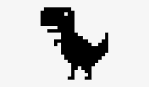

# Dino Runner

Un juego endless runner inspirado en el famoso juego del dinosaurio de Google Chrome, desarrollado en Python utilizando la librería python-arcade.



## Estructura del Proyecto

```
dino_runner/
│
├── assets/ # Recursos del juego como imágenes y sonidos.
│ ├── images/
│ │ ├── dino.png # Sprite del Dinosaurio.
│ │ ├── cactus.png # Sprite del Cactus.
│ │ └── ground.png # Sprite del Suelo.
│ └── sounds/ # (Añade descripciones si hay sonidos en esta carpeta).
│
├── dino_runner/ # Código fuente principal del juego.
│ ├── main.py # Punto de entrada del juego.
│ ├── dino.py # Implementación de la clase Dinosaurio.
│ ├── cactus.py # Implementación de la clase Cactus.
│ └── ground.py # Implementación de la clase Suelo.
│
├── tests/ # Pruebas unitarias para el juego.
│ ├── test_dino.py # Pruebas para la clase Dinosaurio.
│ ├── test_cactus.py # Pruebas para la clase Cactus.
│ └── test_ground.py # Pruebas para la clase Suelo.
│
├── setup.py # Script de configuración para empaquetar/distribuir el juego.
└── requirements.txt # Dependencias del proyecto.
```


## Cómo Jugar

1. Clona el repositorio a tu máquina local:

```bash
git clone https://github.com/alejomongua/endless_runner
```

2. Navega hasta el directorio del proyecto:

```bash
cd endless_runner
```

3. Instala las dependencias:

```bash
pip3 install -r requirements.txt
```

4. Ejecuta el juego:

```bash
python3 run.py
```

5. ¡Disfruta el juego!

## Contribuciones

Si deseas contribuir al proyecto, por favor crea un "fork" del repositorio, realiza tus cambios y envía un "pull request".

## Licencia

MIT

